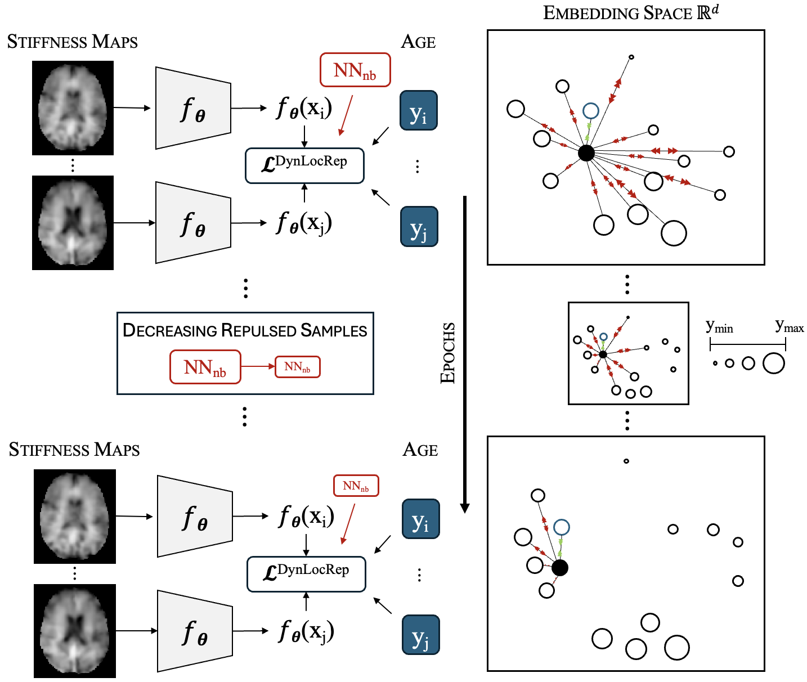

# Contrastive Learning with Dynamic Localized Repulsion for Brain Age Prediction on 3D Stiffness Maps



In the field of neuroimaging, accurate brain age prediction is pivotal for uncovering the complexities of brain aging and pinpointing early indicators of neurological conditions. Recent advancements in self-supervised learning, particularly in contrastive learning, have demonstrated greater robustness when dealing with complex datasets. However, current approaches often fall short in generalizing across non-uniformly distributed data, prevalent in medical imaging scenarios. To bridge this gap, we introduce a novel contrastive loss that dynamically adapts during the training process, focusing on the localized neighborhoods of samples. Moreover, while brain age prediction methods have largely focused on the brain's structural features, the exploration of its mechanical properties has been insufficient, despite their demonstrated promising age-related sensitivity. Thus, we gather brain stiffness maps from healthy individuals across various clinical studies to predict brain age, representing the first application of self-supervised learning to mechanical brain properties. Our findings reveal that our dynamic localized loss outperforms existing state-of-the-art methods.


## Dependencies

python=3.9

numpy=1.26.4

pandas=2.2.1

scikit-learn=1.4.1

scipy=1.12.0

torch=2.2.1

torchvision=0.17.1

wandb=0.16.3


## Running 

### Training

- `src/pretrain_main_infonce.py`: for pre-training on openBHB dataset
- `src/main_dyn_loc_rep.py`: for training models with dynamic localised repulsion loss

To simplify usage, the scripts `src/pretrain_launcher.py` and `src/launcher_dyn_loc_rep.py` come with predefined configurations available as YAML templates in `src/configs`. To initiate:

```
python3 src/pretrain_launcher.py src/configs/pretrain_infonce.yaml
```
to run the pre-training on [openBHB dataset](https://ieee-dataport.org/open-access/openbhb-multi-site-brain-mri-dataset-age-prediction-and-debiasing) under configuration specfied in `src/configs/pretrain_infonce.yaml`. Similarly, to initate training using the dynamic localised repulsions loss:

```
python3 src/launcher_dyn_loc_rep.py src/configs/dyn_loc_rep.yaml
```

### Evaluation

To evaluate models, use:

```
python3 src/evaluate_model.py
```

### Model checkpoints

The checkpoints of the pre-trained model are available [here](https://www.dropbox.com/scl/fo/388sxcfqm8j5wqi8wd48s/h?rlkey=3ecj0nq4xu164kr7tbb47p6dt&dl=0).
